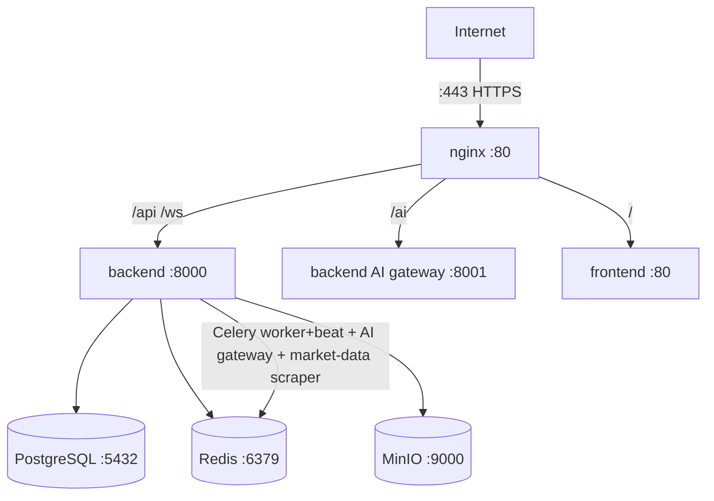
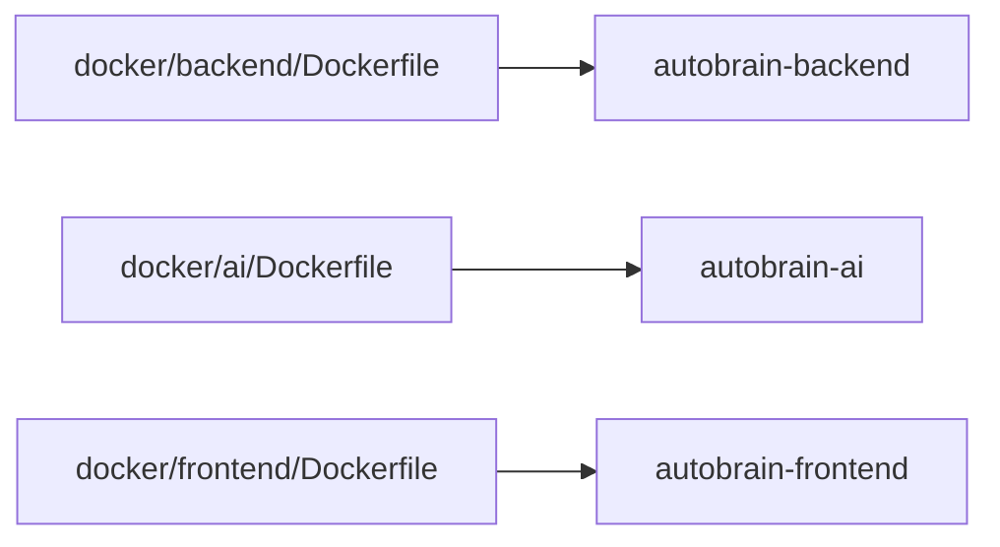
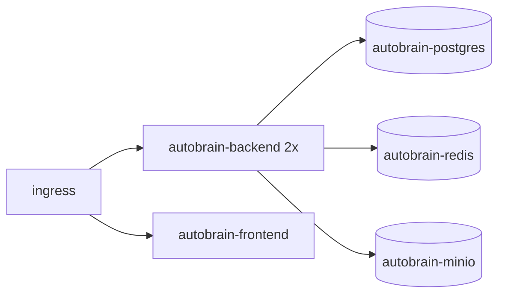

# Infrastructure Diagrams

## Network topology (production)



## Hosted topology (Oracle Cloud)

```mermaid
graph TD
    CF[Cloudflare DNS] -->|autobrainservice.app| NPM[Nginx Proxy Manager :443]
    NPM -->|:8086| Frontend[frontend :8080]
    NPM -->|/api| Backend[backend :8000]
    NPM -->|/ai| BackendAI[backend AI gateway :8001]
    NPM -->|/hub| Hub[federation-hub :8000]
    NPM -->|/dongle| Dongle[dongle-server :8000]
    Backend --> PostgresH[(PostgreSQL :5432)]
    Backend --> RedisH[(Redis :6379)]
    Backend --> MinIOH[(MinIO :9000)]
    Backend -->|Celery worker+beat + market-data scraper + AI gateway (AUT-3153, AUT-3810)| RedisH
    BackendAI -.->|same container| Backend
    Hub -.->|same network| Backend
    Dongle -.->|same network| Backend
    Backup[autobrain-backup :8080] -.->|127.0.0.1 only| Backend
    Router[9Router :20128] -.->|0.0.0.0, firewall allowlisted| Backend
    GHRunner[gh-runner ARM64] -.->|separate stack EP5| DockerSock[(/var/run/docker.sock)]
    Rego[rego-lookup :8011] -.->|127.0.0.1 loopback| Backend
```

## Container image graph



## K8s deployment graph


