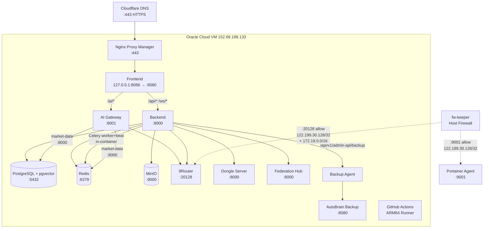
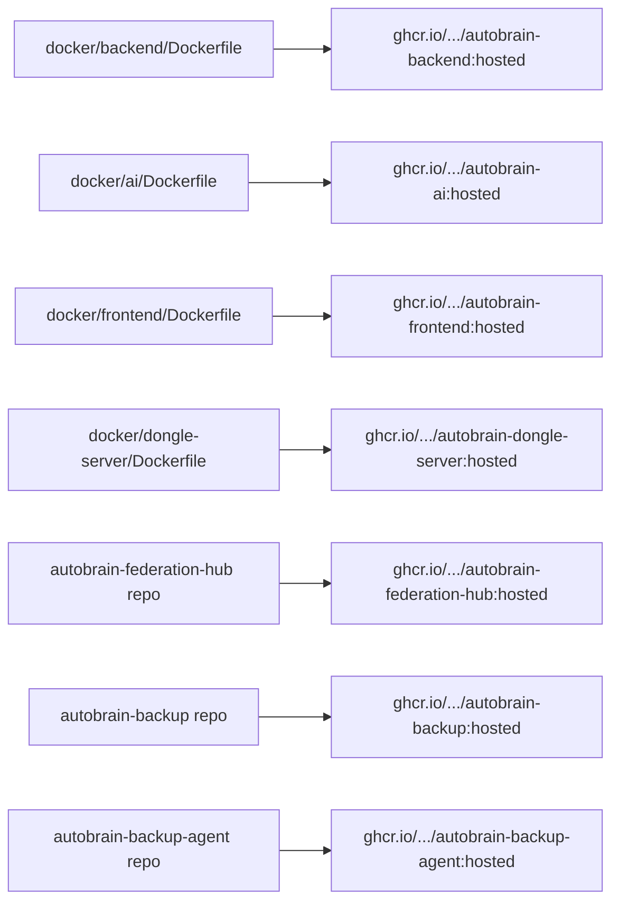
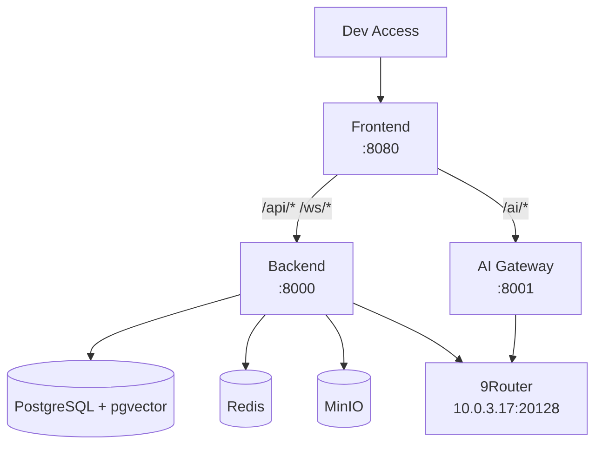

# Infrastructure Diagrams

## Network topology (Hosted — Oracle Cloud)



## Hosted stack services (docker-compose.hosted.yml)

```mermaid
graph LR
    subgraph Stack[autobrain-hosted stack]
        PG[postgres\npgvector/pgvector:pg17]
        RD[redis\nredis:7.2.5-alpine]
        MN[minio\nminio/minio]
        BE[backend\nautobrain-backend:hosted]
        AI[ai\nautobrain-ai:hosted]
        DS[dongle-server\nautobrain-dongle-server:hosted]
        FE[frontend\nautobrain-frontend:hosted]
        HUB[hub\nautobrain-federation-hub:hosted]
        GR[gh-runner\nactions/actions-runner:latest]
        RTR[9router\ndecolua/9router:0.5.55]
        AB[autobrain-backup\nautobrain-backup:hosted]
        BA[backup-agent\nautobrain-backup-agent:hosted]
    end
    PG -.->|volume| PGV[postgres-data]
    RD -.->|volume| RDV[redis-data]
    MN -.->|volume| MNV[minio-data]
    HUB -.->|volume| HV[hub-data]
    RTR -.->|external volume| RTV[9router-data]
    AB -.->|bind| ABC[/data/autobrain-backup/config]
    AB -.->|bind| ABD[/data/autobrain-backup/data]
    BA -.->|bind| BAD[/data/autobrain-backup/agent-data]
    GR -.->|bind| DOCK[/var/run/docker.sock]
    GR -.->|bind| SEC[/run/secrets]
    BE -.->|bind| SEC
    AI -.->|bind| SEC
    DS -.->|bind| SEC
    PG -.->|bind| SEC
    RD -.->|bind| SEC
    MN -.->|bind| SEC
    FE -.->|static IP| NET[172.18.0.14]
    BE -.->|static IP| NET2[172.18.0.15]
```

## Container image graph



## Dev box topology (Portainer EP6, 10.0.3.39)



## Key architectural notes

- **All app containers run non-root**: `read_only: true`, `cap_drop: [ALL]`, `tmpfs` mounts (AUT-1533/CIS hardening).
- **Secret-file pattern (AUT-1533)**: Secrets live in `/data/autobrain/secrets` on host, bind-mounted read-only at `/run/secrets`. `docker/lib-load-secrets.sh` exports `FOO_FILE` → `FOO` at container start. Values never appear in `docker inspect` or `/proc/*/environ`.
- **Unified backend**: API (`:8000`) + Celery worker+beat run in one container (AUT-3153). No separate `worker` service.
- **Stack-local 9Router**: Oracle VM runs its own 9Router instance (`decolua/9router:0.5.55`), published `0.0.0.0:20128` but firewalled to dev egress IP + docker subnet. The corporate 9Router at `10.0.3.17:20128` is NOT reachable from Oracle Cloud.
- **Static IPs**: Frontend `172.18.0.14`, Backend `172.18.0.15` pinned in compose to keep Nginx Proxy Manager's cached IP valid across recreates (AUT-372).
- **External volumes**: `9router-data` is external (preserves provider/API-key config); `postgres-data`, `redis-data`, `minio-data`, `hub-data` are compose-managed.
- **Backup stack**: `autobrain-backup` (web GUI) + `backup-agent` (hourly poller) run as part of the hosted stack.

---

**Related docs:** [`deployment-guide.md`](./deployment-guide.md) | [`ci-cd.md`](./ci-cd.md) | [`server-migration.md`](./server-migration.md) | [`backup-strategy.md`](./backup-strategy.md) | [`monitoring.md`](./monitoring.md) | [`autobrain-deploy-trigger.md`](./autobrain-deploy-trigger.md) | [`security.md`](../Security/security.md)

**Graft usage:** This repo is indexed with Graft (trailhq/Graft). Run `graft map` to orient, `graft ask "<task>"` to find code, `graft grep "<regex>"` for exhaustive search, `graft callers <symbol>` for call graphs, `graft blast --base origin/main` for diff blast radius. See `AGENTS.md` for agent integration.