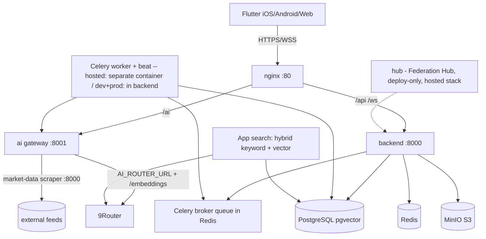

# Architecture

```
┌────────────┐  HTTPS / WSS      ┌───────────────────────────────┐
│  Flutter   │──────────────────▶│  nginx (reverse proxy :80)    │
│ iOS/Android│◀──────────────────│  /api -> backend:8000         │
└────────────┘                   │  /ws   -> backend:8000        │
                                 │  /ai   -> ai:8001             │
                                 └──────────────┬────────────────┘
                                                │
                     ┌──────────────────────────┼──────────────────────────┐
                     ▼                          ▼                          ▼
             ┌──────────────┐          ┌──────────────┐           ┌──────────────┐
             │  backend     │          │  ai          │           │  frontend    │
             │  FastAPI     │          │  gateway     │           │  nginx static│
             └──────┬───────┘          │  :8001       │           └──────────────┘
                    │  REST/WS          │  + market-   │
         ┌──────────┼──────────┐        │  data :8000  │
         ▼          ▼          ▼        └──────┬───────┘
     PostgreSQL   Redis      MinIO      AI_ROUTER_URL|EMBEDDING
     (pgvector)  (cache/     (S3)             ▼
                 broker)                 ┌──────────────┐
         ▲          ▲                    │  9Router     │
         │          │                    └──────────────┘
         └──────────┴──────────────┐
                          ┌──────────────┐
                          │  worker      │  Celery worker + beat
                          │  (hosted)    │
                          └──────────────┘
```

## Deployment topologies

- **Dev:** single `docker-compose.yml` with source mounts + reload. Backend
  container runs the API and the Celery worker+beat (dev compose command).
- **Prod:** `docker-compose.prod.yml` behind nginx frontend container. Backend
  image runs API + Celery worker+beat in one container (see
  `docker/backend/Dockerfile`).
- **Hosted:** `docker-compose.hosted.yml` — prebuilt Docker Hub images, Stripe
  billing, self-service signup, Portainer-managed on Oracle Cloud. Celery
  worker + beat run in a **dedicated `worker` container** (AUT-1242/C1), not in
  backend.
- **Kubernetes:** `infra/k8s/*` deployments + services + secrets.
- **Bare metal:** `infra/systemd/*` units (container-backed).

## Async processing

OCR receipt extraction runs in a Celery worker. The backend stores the file in
MinIO, enqueues `process_receipt`, and the worker calls the AI gateway's OCR
module, then persists extracted items and notifies the client over WebSocket
(`receipt.processed`). In dev/prod the worker runs inside the backend
container; in the hosted stack it is the separate `worker` service.
Scheduled tasks (valuations, reorder suggestions) come from the embedded beat
scheduler, started with `worker -B`.

## High-level architecture (Mermaid)



## Vectorisation (pgvector)

Semantic search is backed by pgvector. The hosted PostgreSQL image is
`pgvector/pgvector:pg17`. See `docs/ai/vector.md` for the schema and embedding
pipeline.