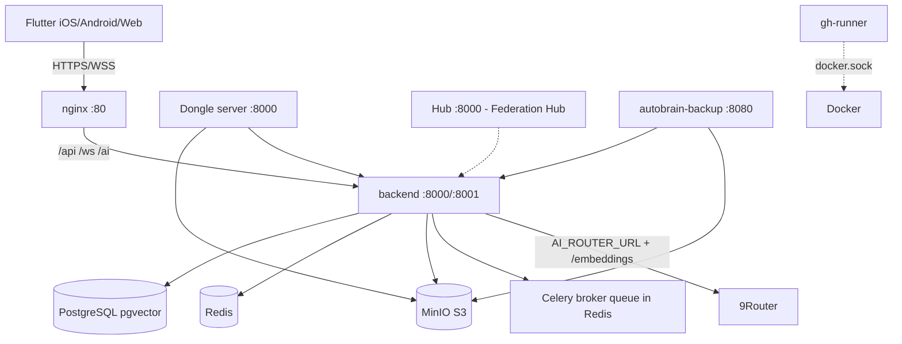

# Architecture

```
┌────────────┐  HTTPS / WSS      ┌───────────────────────────────┐
│  Flutter   │──────────────────▶│  nginx (reverse proxy :80)    │
│ iOS/Android│◀──────────────────│  /api -> backend:8000         │
└────────────┘                   │  /ws   -> backend:8000        │
                                 │  /ai   -> backend:8001        │
                                 └──────────────┬────────────────┘
                                                │
                     ┌──────────────────────────┼──────────────────────────┐
                     ▼                          ▼                          ▼
             ┌──────────────┐          ┌──────────────┐           ┌──────────────┐
             │  backend     │          │  dongle-     │           │  frontend    │
             │  FastAPI     │          │  server      │           │  nginx static│
             │  :8000/:8001 │          │  :8000       │           └──────────────┘
             └──────┬───────┘          └──────┬───────┘
                    │  REST/WS                │
         ┌──────────┼──────────┐              │
         ▼          ▼          ▼              ▼
     PostgreSQL   Redis      MinIO         Hub (Federation)
     (pgvector)  (cache/     (S3)           :8000
                  broker)    ▲              ▲
         ▲          │        │              │
         │          │    9Router             │
         └──────────┴────────┼──────────────┘
                    ┌──────────────┐
                    │  backup      │  Off-site backup
                    │  service     │  :8080
                    └──────────────┘
```

## Deployment topologies

- **Dev:** single `docker-compose.yml` with source mounts + reload. 5 containers:
  postgres, redis, minio, backend (API + AI gateway + Celery worker+beat), frontend.
  Source volumes for hot reload. The AI gateway runs on :8001 inside the backend container.
- **Prod:** `docker-compose.prod.yml` behind nginx frontend container. Backend
  image runs API + AI gateway + Celery worker+beat in one container (see
  `docker/backend/Dockerfile`). 5 containers: postgres, redis, minio, backend, frontend.
- **Hosted:** `docker-compose.hosted.yml` — 10 containers (postgres, redis, minio,
  backend, dongle-server, frontend, hub, gh-runner, 9router, autobrain-backup).
  Prebuilt GHCR images, Stripe billing, self-service signup, Portainer-managed
  on Oracle Cloud ARM64 VM. The backend runs API + AI gateway + Celery worker+beat.
  dongle-server handles OBD dongle firmware distribution. gh-runner provides
  ARM64 GitHub Actions runners. 9router runs locally for LLM/embeddings.
  autobrain-backup provides web GUI for backup management.
- **Kubernetes:** `infra/k8s/*` deployments + services + secrets.
- **Bare metal:** `infra/systemd/*` units (container-backed).

## Async processing

OCR receipt extraction runs in a Celery worker. The backend stores the file in
MinIO, enqueues `process_receipt`, and the worker calls the AI gateway's OCR
module, then persists extracted items and notifies the client over WebSocket
(`receipt.processed`). In dev/prod/hosted the worker runs inside the backend
container (AUT-3153). Scheduled tasks (valuations, reorder suggestions,
backup push) come from the embedded beat scheduler, started with `worker -B`
inside the backend container.

## High-level architecture (Mermaid)


```mermaid
graph TD
    Client[Flutter iOS/Android/Web] -->|HTTPS/WSS| Nginx[nginx :80]
    Nginx -->|/api /ws /ai| Backend[backend :8000/:8001]
    Backend --> Postgres[(PostgreSQL pgvector)]
    Backend --> Redis[(Redis)]
    Backend --> MinIO[(MinIO S3)]
    Backend --> Queen[Celery broker queue in Redis]
    Backend -->|AI_ROUTER_URL + /embeddings| Router[9Router]
    DongleServer[Dongle server :8000] --> MinIO
    DongleServer --> Backend
    Hub[Hub :8000 - Federation Hub] -.-> Backend
    Backup[autobrain-backup :8080] --> Backend
    Backup --> MinIO
    GHRunner[gh-runner] -.->|docker.sock| Docker
```

## Vectorisation (pgvector)

Semantic search is backed by pgvector. The hosted PostgreSQL image is
`pgvector/pgvector:pg17`. See `docs/Engineering/ai/vector.md` for the schema and embedding
pipeline.