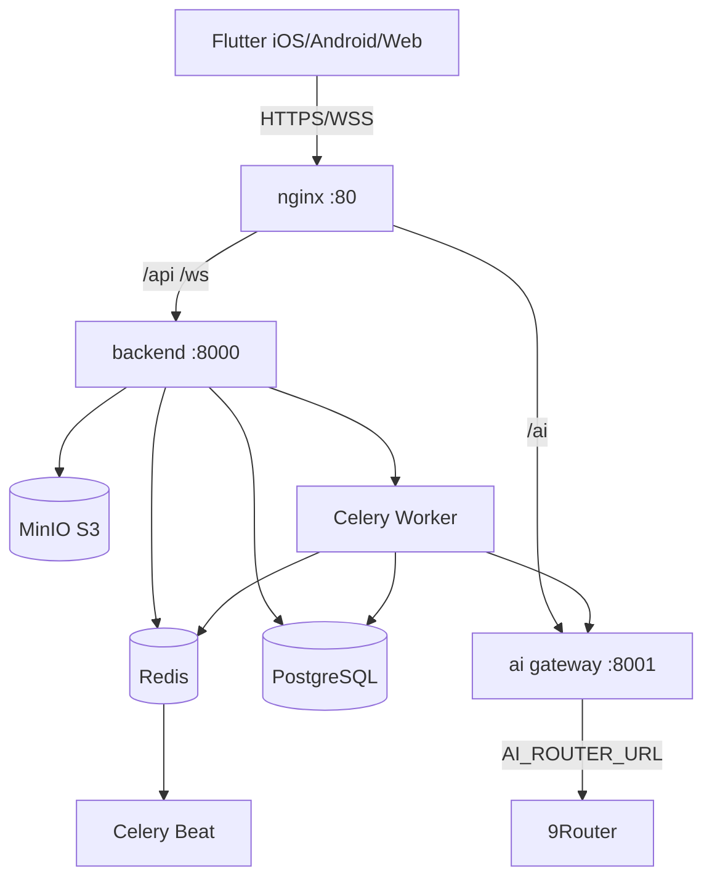

# Architecture

```
┌────────────┐  HTTPS / WSS      ┌───────────────────────────────┐
│  Flutter   │──────────────────▶│  nginx (reverse proxy :80)    │
│ iOS/Android│◀──────────────────│  /api -> backend:8000         │
└────────────┘                   │  /ws   -> backend:8000        │
                                 │  /ai   -> ai:8001             │
                                 └──────────────┬────────────────┘
                                                │
                     ┌──────────────────────────┼──────────────────────────┐
                     ▼                          ▼                          ▼
             ┌──────────────┐          ┌──────────────┐           ┌──────────────┐
             │  backend     │          │  ai gateway  │           │  frontend    │
             │  FastAPI     │          │  FastAPI     │           │  nginx static│
             └──────┬───────┘          └──────┬───────┘           └──────────────┘
                    │  REST/WS                │ AI_ROUTER_URL
         ┌──────────┼───────────┐             ▼
         ▼          ▼           ▼      ┌──────────────┐
     PostgreSQL   Redis      MinIO     │  9Router     │
     (primary)   (cache/     (S3)      └──────────────┘
                  broker)
         ▲
         └── Celery worker + beat
```

## Async processing

OCR receipt extraction runs in a Celery worker. The backend stores the file in
MinIO, enqueues `process_receipt`, and the worker calls the AI gateway's OCR
module, then persists extracted items and notifies the client over WebSocket
(`receipt.processed`).

## High-level architecture (Mermaid)



## Deployment topologies

- **Dev:** single `docker-compose.yml` with source mounts + reload.
- **Prod:** `docker-compose.prod.yml` behind nginx frontend container.
- **Hosted:** `docker-compose.hosted.yml` — prebuilt Docker Hub images, Stripe billing, self-service signup, Portainer-managed on Oracle Cloud.
- **Kubernetes:** `infra/k8s/*` deployments + services + secrets.
- **Bare metal:** `infra/systemd/*` units (container-backed).
