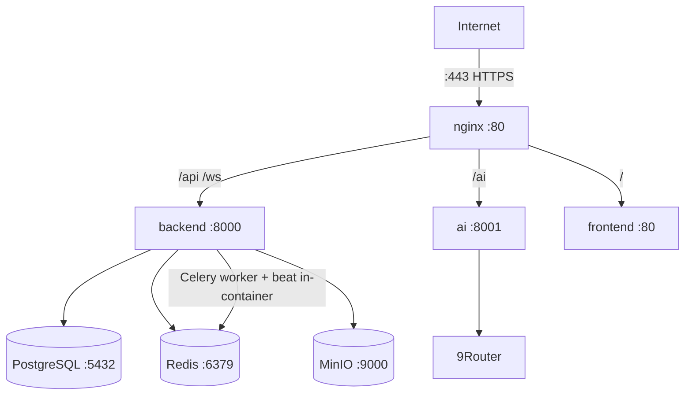
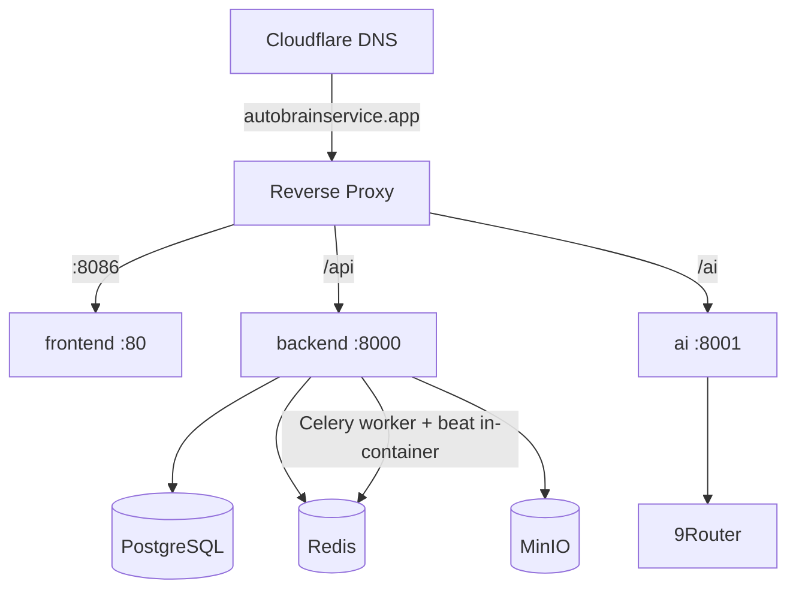
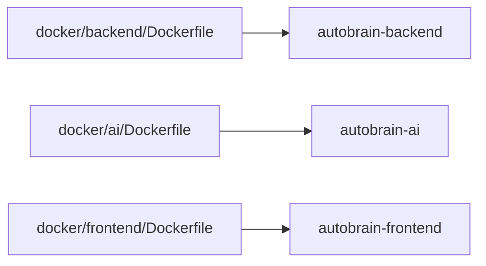
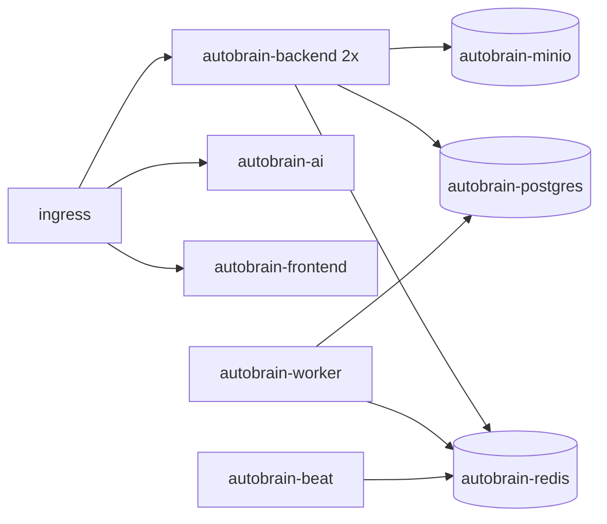

# Infrastructure Diagrams

## Network topology (production)

```mermaid
graph TD
    Net[Internet] -->|:443 HTTPS| Nginx[nginx :80]
    Nginx -->|/api /ws| Backend[backend :8000]
    Nginx -->|/ai| AI[ai :8001]
    Nginx -->|/| Frontend[frontend :80]
    Backend --> Postgres[(PostgreSQL :5432)]
    Backend --> Redis[(Redis :6379)]
    Backend --> MinIO[(MinIO :9000)]
    Backend -->|Celery worker + beat in-container| Redis
    AI --> Router[9Router]
```

## Hosted topology (Oracle Cloud)

```mermaid
graph TD
    CF[Cloudflare DNS] -->|autobrainservice.app| Proxy[Reverse Proxy]
    Proxy -->|:8086| Frontend[frontend :80]
    Proxy -->|/api| Backend[backend :8000]
    Proxy -->|/ai| AI[ai :8001]
    Backend --> PostgresH[(PostgreSQL)]
    Backend --> RedisH[(Redis)]
    Backend --> MinIOH[(MinIO)]
    Backend -->|Celery worker + beat in-container| RedisH
    AI --> Router[9Router]
```

## Container image graph

```mermaid
graph LR
    BF[docker/backend/Dockerfile] --> AB[autobrain-backend]
    AF[docker/ai/Dockerfile] --> AAI[autobrain-ai]
    FF[docker/frontend/Dockerfile] --> AFE[autobrain-frontend]
```

## K8s deployment graph

```mermaid
graph LR
    Ingress[ingress] --> B2[autobrain-backend 2x]
    Ingress --> AI2[autobrain-ai]
    Ingress --> FE2[autobrain-frontend]
    B2 --> PG[(autobrain-postgres)]
    B2 --> RD[(autobrain-redis)]
    B2 --> MN[(autobrain-minio)]
    WorkerK[autobrain-worker] --> RD
    WorkerK --> PG
    BeatK[autobrain-beat] --> RD
```
